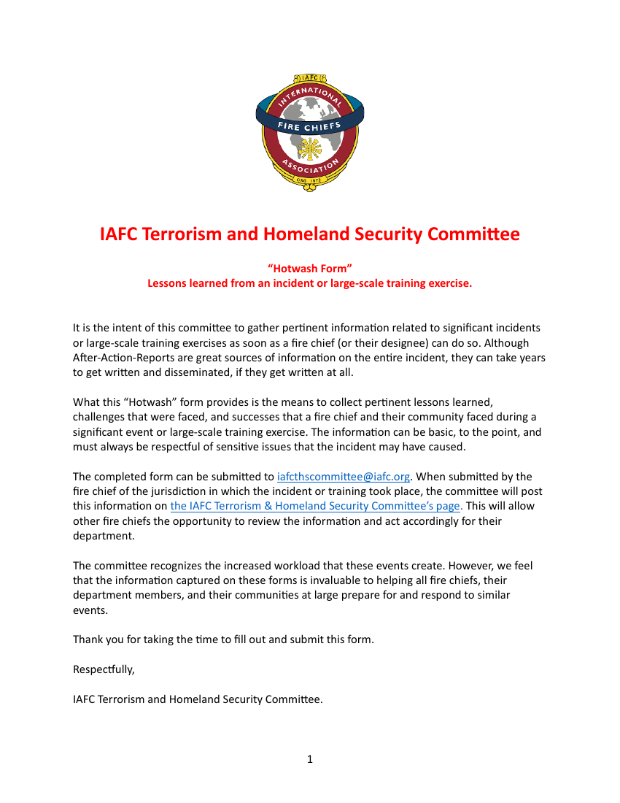

# FI:RECALL — 제출

### 복기는 끝나도, 훈련은 끝나지 않는다 — *From the fire call to total recall.*

> **FI:RECALL converts firefighter debriefs into doctrine-grounded retraining drills.**
> Closing the training loop for firefighters. By NeoMakes.
> Repo: https://github.com/neomakes/fi-recall

---

## 사용한 AI 도구
- [ ] Replit 활용
- [x] **Claude 활용**

---

## 프로젝트 소개

### 문제 (Problem)
소방관은 모든 출동·훈련 뒤 디브리핑(사후검토, AAR/핫워시)을 합니다. 그런데 거기서 나온 교훈이 실제 교리·플레이북으로 이어지지 못하고 "선반에 방치"됩니다. 미국소방서장협회(IAFC)의 핫워시 양식은 그 이유를 직접 적고 있습니다 — 정식 사후검토 보고서는 *"작성되는 데 수년이 걸리거나, 아예 작성되지 않는다."* 결과적으로 같은 실수가 반복되고, 압박이 심한 현장에서 그것은 곧 인명·재산 손실로 이어집니다.

*IAFC "Hotwash" 양식 — 교훈을 빨리 잡으려는 시도 자체가, 루프가 끊겼다는 증거.*

### 솔루션 (Solution)
FI:RECALL은 훈련을 통해 팀을 성장하도록 지원하는 OS 솔루션으로, 두 단계로 작동합니다:

**① 교리 지도화 — [데모 훅 🎣]**
텍스트로 흩어진 SOP 교리집을 한눈에 보이는 교리 지도로 구조화합니다. 절차·판단점·위험·표준이 노드가 되고, 선후·의존·예외 관계가 연결로 드러납니다.

**② 복기 반영 — [데모 킥 ⚽]**
훈련자·현장 피드백을 입력하면 FI:RECALL이 다음을 수행합니다:
- 교리 지도의 어느 지점에 닿는지 자동으로 태깅하고,
- 과거 같은 지점의 교훈과 대조해 재발을 표시하고,
- 격차를 두 갈래로 분류해 고리를 닫습니다:
  - 교리 격차(*아는 것*의 문제) → SOP 수정 제안
  - 실행 격차(*몸이 따르는 것*의 문제) → 재훈련 drill

### AI 활용
Claude는 FI:RECALL에서 보조 기능이 아니라 제품 그 자체입니다. *"이 모델을 빼면 제품이 존재하는가?"* — 답은 "아니오"입니다. Claude를 빼면 그냥 텍스트 SOP와 잊히는 교훈으로 돌아갑니다.

핵심 가치인 *"지저분한 자연어 복기 → 구조화된 교리 지도 → 수정안/drill"* 의 모든 단계가 의미 추론이며, 이는 프런티어 LLM만 수행할 수 있습니다:

| 단계 | 왜 Claude여야만 하나 |
|---|---|
| 교리 지도화 | 교리의 암묵적·맥락적 관계를 읽어내는 의미 추론 |
| 피드백 grounding | 모호한 현장 언어를 정답 노드에 매핑 |
| 격차 분류 | 서사 속 의도·인과를 이해하는 추론 (분류기로 불가) |
| 수정안/drill 생성 | 교리에 충실한 편집안 생성 |

우리는 모델을 채팅창으로 쓰지 않습니다. Claude의 추론을 개념 추출·엣지 최적화·확률적 grounding·재발 상태 추적이라는 형식적 알고리즘이 감쌉니다 — 교리 온톨로지 위에서 도는 credit-assignment 최적화. AI는 UI가 아니라 추론 엔진입니다.

**왜 Anthropic인가:** 출력이 소방관의 플레이북을 직접 편집하므로, 환각은 곧 인명 위험입니다. 충실성(faithfulness)이 곧 안전요건이며, 그래서 "아무 LLM"이 아니라 충실성을 최우선으로 설계된 Claude여야 합니다.

제품뿐 아니라 빌드 과정에서도 Claude로 1차 자료(FM 7-0 부록 K·IAFC Hotwash·8-step 모델·소방 AAR) 리서치·비교 분석·교리 지도 설계를 수행했습니다 — `reference/` 번들이 그 산출물입니다.

### 기대 결과 / 임팩트
우리는 가치를 주장하지 않고 측정 설계로 검증합니다. 지표를 4층으로 나누고, 6주 내 검증 가능 여부를 정직하게 라벨링합니다.

**정량 지표 (Before → After, 검증 목표 = 가설):**

| | Before (현행) | After |
|---|---|---|
| 교훈 → 갱신 시간 | 수일~수년, 혹은 영영(IAFC) | < 10분 |
| 종결까지 추적 | 거의 0 (선반 방치) | 추적·종결률 계측 가능 |
| 절차 이해 | 텍스트 SOP 탐색 | 교리 지도로 탐색시간 단축 |
| 출력 수용률 | - | 목표 ≥ 60% (훈련담당관 판정) |

**성장 신호 (6주):** 소방 훈련담당/지휘관 인터뷰 8–10명(문제 확증), 파일럿 서 1–3곳 확보, 활성 사용(처리된 복기 수·생성 출력 수·수용 건수).

**후행 지표(계측만 심고 분기 단위 측정):** 결함 재발률↓, 유지율, 서당 구독매출 — 6주 초과 항목으로 정직하게 분리.

**6주 내 검증 계획:**
- W1–2 — 훈련담당 8–10명 인터뷰 + 파일럿 서 1–3곳 확보, 실제 SOP를 교리 지도로 적재
- W3–4 — 실제 복기로 지연시간·수용률 측정 + 교리 지도 vs 텍스트 SOP 이해 A/B 테스트
- W5–6 — 수용률 개선, 종결 추적 계측 심기, Before/After 리포트 작성, 파일럿 연장/LOI 확보

**스타트업 기여:** 운영(교리 갱신 시간↓·종결률↑) · 고객 서비스/공공안전(재발↓→대응 품질↑) · 판매(수용률·Before/After 리포트가 ROI 영업자료) · 성장(파일럿 도입 서 수·활성 사용·유료 전환).

**중장기 확장:** AAR이 존재하는 모든 고위험 도메인 — 특수작전·EMS·산업안전·항공 — 으로 동일 아키텍처 확장. 지표를 재발률·유지율·서당 구독매출로 승급.

### 핵심 기능 소개
**데모에서 확인할 핵심 가치:** 끊긴 학습 루프가 닫히는 순간 — debrief in → drill out.

**테스트 절차:**
1. **[훅 — 이해]** 소방 SOP 한 섹션을 넣으면, 빽빽한 텍스트가 한 장의 교리 지도로 구조화되는 걸 확인합니다. → AI가 교리의 암묵적 관계를 추론해 그래프로 만든 결과.
2. **[킥 — 루프]** 현장 복기(피드백) 한 줄을 입력합니다.
3. FI:RECALL이 그 피드백이 닿는 교리 노드를 태깅하고, 과거 동일 지점의 교훈과 대조해 재발을 표시합니다.
4. 격차 유형에 따라 출력이 갈립니다 — 교리 격차 → SOP 수정 제안, 실행 격차 → 재훈련 drill.

**AI가 기여하는 지점:** 1~4 모든 단계의 추론(지도화·태깅·재발 대조·생성)이 Claude입니다.
**사용 전후 변화:** Before(디브리핑이 문서로 묻힘) → After(교리에 고정·추적되는 수정안/drill).

---

## 추가 정보 — 개발 시작 시점 증빙

- **GitHub 최초 커밋 링크:** https://github.com/neomakes/fi-recall/commit/ea015d93ba2cdd33862eede147ce72264c058af1
- **Replit 프로젝트 생성 시점 / Task board 스크린샷:** 해당 없음 (Replit 미사용)
- **Claude 활용 기록 또는 작업 과정 스크린샷:** Claude 세션에서 리서치 → 교리 지도(온톨로지) 설계 → 제출 트래커 제작 순으로 진행. 산출물 증거: `reference/` 번들(원문+한국어+비교 분석), `submission/tracker.html`. *(대화 스크린샷 별도 첨부 가능)*
- **빌드 시작 전 프로젝트 상태 캡처:** `submission/03_description/스크린샷 2026-06-18 오후 2.36.18.png`
- **기타 증빙 자료:** `reference/` 1차 자료 번들(FM 7-0 부록 K·IAFC Hotwash 양식·8-step 모델·소방 AAR), `submission/tracker.html`
